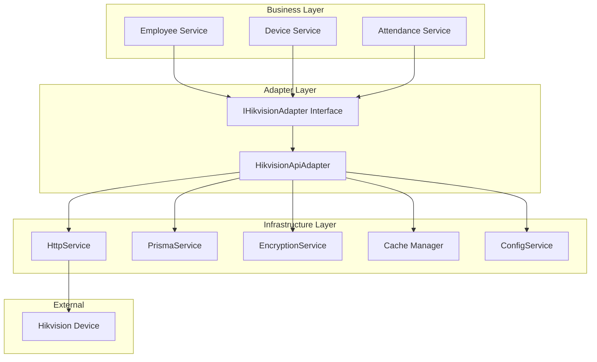

# Design Document

## Overview

The HikvisionApiAdapter is a NestJS service that implements the IHikvisionAdapter interface to provide seamless integration with Hikvision access control devices through their ISAPI protocol. The adapter follows the Adapter design pattern to abstract the complexity of HTTP-based device communication behind simple, clean methods.

The design emphasizes security through encrypted credential storage, performance through intelligent session caching, and reliability through comprehensive error handling. The adapter serves as a critical bridge between the system's business logic and physical hardware, ensuring that device integration doesn't compromise the system's architecture or maintainability.

## Architecture

### High-Level Architecture



### Component Dependencies

The HikvisionApiAdapter depends on the following NestJS services:

- **HttpService** (`@nestjs/axios`): For HTTP/HTTPS communication with devices
- **PrismaService**: For reading device configuration from database
- **EncryptionService**: For decrypting stored device credentials
- **Cache Manager** (`@nestjs/cache-manager`): For session key caching
- **ConfigService** (`@nestjs/config`): For accessing environment configuration

## Components and Interfaces

### Core Interface Definition

```typescript
export interface IHikvisionAdapter {
  addUser(deviceId: string, userData: CreateDeviceUserDto): Promise<boolean>;
  updateUser(deviceId: string, employeeNo: string, userData: UpdateDeviceUserDto): Promise<boolean>;
  deleteUser(deviceId: string, employeeNo: string): Promise<boolean>;
  findUserByEmployeeNo(deviceId: string, employeeNo: string): Promise<DeviceUserInfo | null>;
  getFaceData(deviceId: string, employeeNo: string): Promise<Buffer | null>;
}
```

### Data Transfer Objects

```typescript
// Input DTOs
export class CreateDeviceUserDto {
  @IsString()
  @IsNotEmpty()
  employeeNo: string;

  @IsString()
  @IsNotEmpty()
  name: string;

  @IsEnum(['normal', 'visitor'])
  userType: 'normal' | 'visitor';
}

export class UpdateDeviceUserDto {
  @IsString()
  @IsOptional()
  name?: string;

  @IsEnum(['normal', 'visitor'])
  @IsOptional()
  userType?: 'normal' | 'visitor';
}

// Output Interface
export interface DeviceUserInfo {
  employeeNo: string;
  name: string;
  userType: string;
}
```

### Session Management Types

```typescript
interface SecureSession {
  security: string;
  identityKey: string;
}

interface CachedSession extends SecureSession {
  expiresAt: number;
}
```

## Data Models

### Database Schema Requirements

The adapter requires the following fields in the Device model:

```prisma
model Device {
  id               String  @id @default(cuid())
  host        String?
  username         String?
  encryptedSecret  String?
  // ... other fields
}
```

### Environment Configuration

Required environment variables for encryption:

```env
SECRET_ENCRYPTION_KEY=<32-byte-hex-key>
SECRET_ENCRYPTION_IV=<16-byte-hex-iv>
```

### Cache Key Strategy

Session cache keys follow the pattern: `hik_session_{deviceId}`

## Error Handling

### Exception Mapping Strategy

The adapter maps device HTTP responses to appropriate NestJS exceptions:

| Device Response | NestJS Exception | Use Case |
|----------------|------------------|----------|
| 200 OK | Success | Normal operation |
| 401 Unauthorized | UnauthorizedException | Invalid credentials |
| 404 Not Found | NotFoundException | User/resource not found |
| 400 Bad Request | BadRequestException | Invalid data format |
| 500+ Server Error | InternalServerErrorException | Device/network issues |
| Network Timeout | InternalServerErrorException | Connection problems |

### Error Context Preservation

All exceptions include contextual information:
- Device ID
- Operation being performed
- Original error details (sanitized)
- Correlation ID for tracing

## Implementation Details

### Core Service Structure

```typescript
@Injectable()
export class HikvisionApiAdapter implements IHikvisionAdapter {
  private readonly logger = new Logger(HikvisionApiAdapter.name);

  constructor(
    @Inject(CACHE_MANAGER) private cacheManager: Cache,
    private readonly httpService: HttpService,
    private readonly prisma: PrismaService,
    private readonly encryptionService: EncryptionService,
  ) {}

  // Public interface methods
  // Private helper methods
}
```

### Session Management Design

The adapter implements intelligent session caching to optimize performance:

1. **Cache Check**: First check if valid session exists in cache
2. **Session Acquisition**: If not cached, request new session from device
3. **Cache Storage**: Store session with 10-minute TTL
4. **Automatic Refresh**: Handle expired sessions transparently

```typescript
private async getSecureSession(device: Device): Promise<SecureSession> {
  const cacheKey = `hik_session_${device.id}`;
  
  // Check cache first
  const cached = await this.cacheManager.get<CachedSession>(cacheKey);
  if (cached && cached.expiresAt > Date.now()) {
    return { security: cached.security, identityKey: cached.identityKey };
  }

  // Acquire new session
  const session = await this.acquireNewSession(device);
  
  // Cache with TTL
  await this.cacheManager.set(cacheKey, {
    ...session,
    expiresAt: Date.now() + 600000 // 10 minutes
  }, { ttl: 600 });

  return session;
}
```

### HTTP Request Patterns

#### Standard Operations (User Management)

```typescript
// Pattern for user operations
const endpoint = `http://${device.host}/ISAPI/AccessControl/UserInfo/Record?format=json`;
const response = await firstValueFrom(
  this.httpService.post(endpoint, payload, {
    auth: { username: device.username, password: decryptedPassword },
    timeout: 10000
  })
);
```

#### Secure Operations (Face Data)

```typescript
// Pattern for operations requiring session keys
const session = await this.getSecureSession(device);
const endpoint = `http://${device.host}/ISAPI/Intelligent/FDLib`;
const response = await firstValueFrom(
  this.httpService.get(endpoint, {
    params: {
      format: 'json',
      employeeNo,
      security: session.security,
      identityKey: session.identityKey
    },
    responseType: 'arraybuffer'
  })
);
```

### Authentication Strategy

The adapter leverages axios's automatic authentication handling:

1. **Initial Request**: Send request with auth credentials
2. **Challenge Response**: If device returns 401 with WWW-Authenticate header
3. **Automatic Handling**: Axios automatically handles Digest or Basic auth
4. **Retry**: Resend request with proper authentication headers

This approach eliminates the need for manual Digest authentication implementation.

## Testing Strategy

### Unit Testing Approach

#### Mock Strategy

All external dependencies are mocked using Jest:

```typescript
describe('HikvisionApiAdapter', () => {
  let adapter: HikvisionApiAdapter;
  let httpService: jest.Mocked<HttpService>;
  let prismaService: any;
  let encryptionService: jest.Mocked<EncryptionService>;
  let cacheManager: jest.Mocked<Cache>;

  beforeEach(async () => {
    const module = await Test.createTestingModule({
      providers: [
        HikvisionApiAdapter,
        { provide: HttpService, useValue: createMockHttpService() },
        { provide: PrismaService, useValue: createMockPrismaService() },
        { provide: EncryptionService, useValue: createMockEncryptionService() },
        { provide: CACHE_MANAGER, useValue: createMockCacheManager() },
      ],
    }).compile();

    adapter = module.get<HikvisionApiAdapter>(HikvisionApiAdapter);
    // ... get mocked services
  });
});
```

#### Test Scenarios

1. **Success Paths**: Verify correct HTTP calls and response handling
2. **Error Paths**: Verify proper exception throwing for various error conditions
3. **Caching**: Verify session caching and cache hit/miss scenarios
4. **Authentication**: Verify credential decryption and HTTP auth setup

### Integration Testing Approach

#### HTTP Mocking with MSW

```typescript
import { setupServer } from 'msw/node';
import { rest } from 'msw';

const server = setupServer(
  rest.post('http://192.168.1.100/ISAPI/AccessControl/UserInfo/Record', (req, res, ctx) => {
    return res(ctx.status(200), ctx.json({ success: true }));
  }),
  
  rest.get('http://192.168.1.100/ISAPI/System/Security/identityKey', (req, res, ctx) => {
    return res(ctx.json({ security: 'test-key', identityKey: 'test-identity' }));
  })
);
```

#### Test Database Setup

Use test database with seeded device data:

```typescript
const testDevice = {
  id: 'test-device-1',
  host: '192.168.1.100',
  username: 'admin',
  encryptedSecret: 'encrypted-password-data'
};
```

### Performance Testing Considerations

1. **Session Caching Efficiency**: Measure cache hit rates and session reuse
2. **Concurrent Request Handling**: Test multiple simultaneous device operations
3. **Error Recovery**: Test behavior under network failures and device unavailability
4. **Memory Usage**: Monitor cache memory consumption with many devices

## Security Considerations

### Credential Protection

1. **Encryption at Rest**: All device passwords encrypted with AES-256
2. **Memory Safety**: Decrypted passwords not stored in memory longer than necessary
3. **Logging Safety**: No credentials logged in plain text
4. **Transport Security**: HTTPS recommended for production deployments

### Session Security

1. **Session Isolation**: Each device has independent session management
2. **Session Expiry**: Automatic session expiration prevents stale credentials
3. **Cache Security**: Session keys stored in secure cache with TTL

### Network Security

1. **Timeout Protection**: All HTTP requests have reasonable timeouts
2. **Error Information**: Error messages don't expose sensitive device details
3. **Authentication Handling**: Automatic handling prevents credential exposure

## Deployment and Configuration

### Module Registration

```typescript
@Module({
  imports: [
    HttpModule.register({
      timeout: 10000,
      maxRedirects: 3,
    }),
    CacheModule.register({
      ttl: 600, // 10 minutes default
      max: 1000, // Maximum cached items
    }),
  ],
  providers: [HikvisionApiAdapter],
  exports: [HikvisionApiAdapter],
})
export class HikvisionAdapterModule {}
```

### Environment Setup

Required environment configuration:
- Encryption keys for credential security
- Cache configuration for session management
- HTTP timeout and retry settings
- Logging levels for troubleshooting

### Monitoring and Observability

1. **Metrics**: Track success/failure rates, response times, cache hit rates
2. **Logging**: Structured logs with correlation IDs for request tracing
3. **Health Checks**: Device connectivity monitoring
4. **Alerting**: Notifications for authentication failures or device unavailability