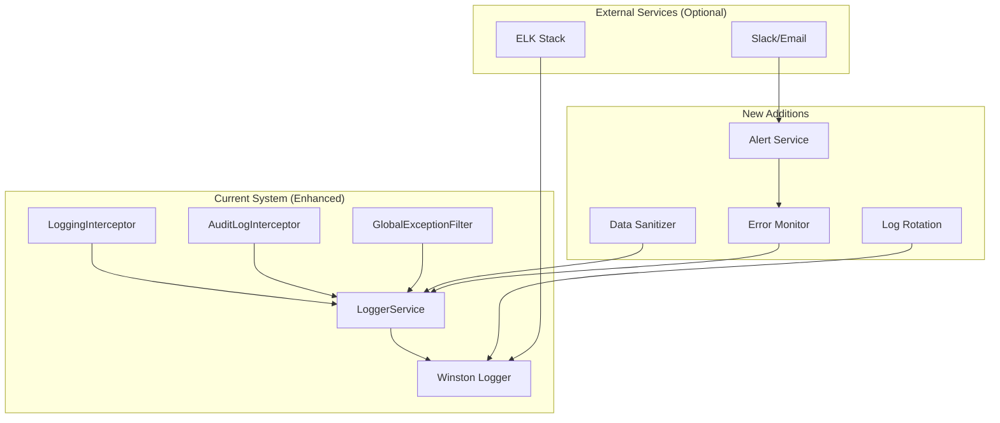

# Logging System Improvement - Design Document

## Overview

Bu design document hozirgi Winston-based logging tizimini step-by-step yaxshilash uchun practical approach belgilaydi. Murakkab architecture o'rniga, mavjud tizimni kengaytirib, performance, maintainability va monitoring jihatlarini bosqichma-bosqich yaxshilaymiz.

## Current State Analysis

### Existing Components
- **LoggerService**: Winston-based, basic functionality
- **LoggingInterceptor**: API request/response logging
- **AuditLogInterceptor**: User action tracking
- **CorrelationIdMiddleware**: Request correlation
- **GlobalExceptionFilter**: Error logging

### Current Issues
- Inconsistent log formats
- Performance bottlenecks (synchronous logging)
- No log rotation or cleanup
- Limited monitoring and alerting
- Manual log analysis

## Simplified Architecture



## Components and Interfaces

### 1. Enhanced LoggerService (Backward Compatible)

```typescript
// Extend existing LoggerService without breaking changes
class LoggerService {
    // Existing methods (unchanged)
    log(message: string, context?: LogContext): void;
    error(message: string, trace?: string, context?: LogContext): void;
    warn(message: string, context?: LogContext): void;
    debug(message: string, context?: LogContext): void;
    
    // New enhanced methods
    logBusinessEvent(event: string, data: any, context?: LogContext): void;
    logPerformance(operation: string, duration: number, context?: LogContext): void;
    
    // Internal improvements
    private sanitizeData(data: any): any;
    private enrichContext(context: LogContext): LogContext;
}
```

### 2. Data Sanitization (Simple Implementation)

```typescript
class DataSanitizer {
    private sensitiveFields = [
        'password', 'token', 'secret', 'key', 'authorization',
        'cookie', 'session', 'credential', 'pin'
    ];
    
    sanitize(data: any): any {
        if (typeof data !== 'object' || data === null) return data;
        
        const sanitized = { ...data };
        for (const [key, value] of Object.entries(sanitized)) {
            if (this.isSensitive(key)) {
                sanitized[key] = '[REDACTED]';
            } else if (typeof value === 'object') {
                sanitized[key] = this.sanitize(value);
            }
        }
        return sanitized;
    }
    
    private isSensitive(fieldName: string): boolean {
        return this.sensitiveFields.some(field => 
            fieldName.toLowerCase().includes(field)
        );
    }
}
```

### 3. Error Monitoring (Simple)

```typescript
class ErrorMonitor {
    private errorCounts = new Map<string, number>();
    private alertThreshold = 10; // errors per minute
    
    recordError(module: string, error: Error): void {
        const key = `${module}:${Date.now() - (Date.now() % 60000)}`; // per minute
        const count = this.errorCounts.get(key) || 0;
        this.errorCounts.set(key, count + 1);
        
        if (count + 1 >= this.alertThreshold) {
            this.sendAlert(module, count + 1);
        }
    }
    
    private async sendAlert(module: string, errorCount: number): Promise<void> {
        // Send alert via configured channels
        console.error(`ALERT: ${module} has ${errorCount} errors in the last minute`);
    }
}
```

### 4. Log Rotation (Winston Configuration)

```typescript
// Enhanced winston.config.ts
export const winstonConfig: WinstonModuleOptions = {
    transports: [
        // Console (unchanged)
        new transports.Console({ /* existing config */ }),
        
        // Enhanced file transport with rotation
        new transports.File({
            filename: 'logs/combined.log',
            level: 'info',
            format: combine(timestamp(), json()),
            maxsize: 50 * 1024 * 1024, // 50MB
            maxFiles: 30, // Keep 30 files (30 days)
            tailable: true,
            zippedArchive: true, // Compress old files
        }),
        
        // Enhanced error file transport
        new transports.File({
            filename: 'logs/error.log',
            level: 'error',
            format: combine(timestamp(), json()),
            maxsize: 50 * 1024 * 1024, // 50MB
            maxFiles: 30,
            tailable: true,
            zippedArchive: true,
        }),
    ],
};
```

## Data Models

### Standardized Log Context (Simple)

```typescript
// Enhanced LogContext (extends existing)
interface LogContext {
    // Existing fields
    correlationId?: string;
    userId?: string;
    organizationId?: string;
    module?: string;
    
    // New standardized fields
    operation?: string;
    duration?: number;
    errorCode?: string;
    businessEvent?: string;
    
    // Flexible metadata
    [key: string]: any;
}

// Business Event Structure
interface BusinessEventData {
    event: string;
    entity: string;
    entityId: string;
    action: string;
    metadata?: Record<string, any>;
}

// Performance Data Structure
interface PerformanceData {
    operation: string;
    duration: number;
    startTime: Date;
    endTime: Date;
    metadata?: Record<string, any>;
}
```

### Configuration (Environment-based)

```typescript
// Simple configuration interface
interface LoggingConfig {
    level: LogLevel;
    enableFileLogging: boolean;
    enableRotation: boolean;
    maxFileSize: string; // '50MB'
    maxFiles: number;
    enableCompression: boolean;
    enableAlerting: boolean;
    alertThreshold: number;
    
    // External services (optional)
    elasticsearch?: {
        enabled: boolean;
        endpoint: string;
        apiKey?: string;
    };
    
    slack?: {
        enabled: boolean;
        webhookUrl: string;
        channel: string;
    };
}
```

## Error Handling

### Simple Error Recovery

```typescript
// Simple error handling in LoggerService
class LoggerService {
    private errorMonitor = new ErrorMonitor();
    
    error(message: string, trace?: string, context?: LogContext): void {
        try {
            // Record error for monitoring
            this.errorMonitor.recordError(context?.module || 'unknown', new Error(message));
            
            // Sanitize context data
            const sanitizedContext = this.sanitizeData(context);
            
            // Log with Winston (existing functionality)
            this.logger.error(message, { context: sanitizedContext, trace });
        } catch (loggingError) {
            // Fallback to console if logging fails
            console.error('Logging failed:', loggingError.message);
            console.error('Original error:', message);
        }
    }
    
    private sanitizeData(data: any): any {
        try {
            return this.dataSanitizer.sanitize(data);
        } catch (sanitizationError) {
            console.warn('Data sanitization failed:', sanitizationError.message);
            return { error: 'Failed to sanitize data' };
        }
    }
}
```

### Disk Space Monitoring

```typescript
// Simple disk space monitoring
class DiskSpaceMonitor {
    private checkInterval = 60000; // 1 minute
    private warningThreshold = 0.8; // 80%
    private criticalThreshold = 0.9; // 90%
    
    startMonitoring(): void {
        setInterval(() => {
            this.checkDiskSpace();
        }, this.checkInterval);
    }
    
    private async checkDiskSpace(): Promise<void> {
        try {
            const stats = await fs.promises.statfs('./logs');
            const usagePercent = (stats.blocks - stats.bavail) / stats.blocks;
            
            if (usagePercent > this.criticalThreshold) {
                console.error(`CRITICAL: Disk usage at ${(usagePercent * 100).toFixed(1)}%`);
                // Trigger log cleanup
                await this.cleanupOldLogs();
            } else if (usagePercent > this.warningThreshold) {
                console.warn(`WARNING: Disk usage at ${(usagePercent * 100).toFixed(1)}%`);
            }
        } catch (error) {
            console.error('Failed to check disk space:', error.message);
        }
    }
    
    private async cleanupOldLogs(): Promise<void> {
        // Remove logs older than 7 days in critical situations
        const sevenDaysAgo = new Date(Date.now() - 7 * 24 * 60 * 60 * 1000);
        // Implementation for cleanup...
    }
}
```

## Testing Strategy

### Simple Unit Testing

```typescript
describe('DataSanitizer', () => {
    let sanitizer: DataSanitizer;
    
    beforeEach(() => {
        sanitizer = new DataSanitizer();
    });
    
    it('should redact sensitive fields', () => {
        const data = {
            username: 'john',
            password: 'secret123',
            email: 'john@example.com'
        };
        
        const result = sanitizer.sanitize(data);
        
        expect(result).toEqual({
            username: 'john',
            password: '[REDACTED]',
            email: 'john@example.com'
        });
    });
    
    it('should handle nested objects', () => {
        const data = {
            user: {
                name: 'john',
                credentials: {
                    password: 'secret',
                    token: 'abc123'
                }
            }
        };
        
        const result = sanitizer.sanitize(data);
        
        expect(result.user.credentials.password).toBe('[REDACTED]');
        expect(result.user.credentials.token).toBe('[REDACTED]');
    });
});
```

### Integration Testing

```typescript
describe('Enhanced Logging', () => {
    let loggerService: LoggerService;
    
    beforeEach(() => {
        loggerService = new LoggerService(/* dependencies */);
    });
    
    it('should log business events correctly', () => {
        const spy = jest.spyOn(loggerService['logger'], 'info');
        
        loggerService.logBusinessEvent('user_login', {
            userId: '123',
            method: 'email'
        }, { module: 'auth' });
        
        expect(spy).toHaveBeenCalledWith(
            'Business Event: user_login',
            expect.objectContaining({
                context: expect.objectContaining({
                    businessEvent: 'user_login',
                    module: 'auth'
                })
            })
        );
    });
    
    it('should log performance metrics', () => {
        const spy = jest.spyOn(loggerService['logger'], 'info');
        
        loggerService.logPerformance('database_query', 150, {
            module: 'database'
        });
        
        expect(spy).toHaveBeenCalledWith(
            'Performance: database_query completed in 150ms',
            expect.objectContaining({
                context: expect.objectContaining({
                    operation: 'database_query',
                    duration: 150
                })
            })
        );
    });
});
```

### Log Rotation Testing

```typescript
describe('Log Rotation', () => {
    it('should rotate logs when size limit is reached', async () => {
        // Create large log entries to trigger rotation
        const largeMessage = 'x'.repeat(1024 * 1024); // 1MB message
        
        for (let i = 0; i < 60; i++) { // Should exceed 50MB limit
            loggerService.log(largeMessage, { module: 'rotation-test' });
        }
        
        // Wait for rotation to complete
        await new Promise(resolve => setTimeout(resolve, 1000));
        
        // Check that rotated files exist
        const logFiles = await fs.promises.readdir('./logs');
        const rotatedFiles = logFiles.filter(file => 
            file.includes('combined') && file.includes('.gz')
        );
        
        expect(rotatedFiles.length).toBeGreaterThan(0);
    });
});
```

## Security Considerations

### Data Protection (Simple)

```typescript
// Basic security measures for logging
class LogSecurity {
    // Sensitive field patterns
    private sensitivePatterns = [
        /password/i,
        /token/i,
        /secret/i,
        /key/i,
        /authorization/i,
        /credential/i,
        /pin/i
    ];
    
    // Check if field contains sensitive data
    isSensitiveField(fieldName: string): boolean {
        return this.sensitivePatterns.some(pattern => 
            pattern.test(fieldName)
        );
    }
    
    // Redact sensitive values
    redactValue(value: any): string {
        if (typeof value === 'string') {
            return value.length > 0 ? `[REDACTED:${value.length}]` : '[REDACTED]';
        }
        return '[REDACTED]';
    }
    
    // Basic log file permissions
    setLogFilePermissions(filePath: string): void {
        try {
            // Set read/write for owner only (600)
            fs.chmodSync(filePath, 0o600);
        } catch (error) {
            console.warn(`Failed to set log file permissions: ${error.message}`);
        }
    }
}
```

### Environment-based Security

```typescript
// Security configuration based on environment
class SecurityConfig {
    static getConfig(environment: string) {
        switch (environment) {
            case 'production':
                return {
                    sanitizeData: true,
                    logLevel: 'warn', // Less verbose in production
                    enableFileLogging: true,
                    enableConsoleLogging: false,
                    restrictFilePermissions: true
                };
            
            case 'staging':
                return {
                    sanitizeData: true,
                    logLevel: 'info',
                    enableFileLogging: true,
                    enableConsoleLogging: true,
                    restrictFilePermissions: true
                };
            
            case 'development':
            default:
                return {
                    sanitizeData: false, // Allow full data for debugging
                    logLevel: 'debug',
                    enableFileLogging: true,
                    enableConsoleLogging: true,
                    restrictFilePermissions: false
                };
        }
    }
}
```

## Performance Optimizations

### Simple Async Logging

```typescript
// Simple async logging implementation
class AsyncLogger {
    private logQueue: string[] = [];
    private isProcessing = false;
    private maxQueueSize = 1000;
    
    async log(message: string): Promise<void> {
        // Add to queue
        if (this.logQueue.length >= this.maxQueueSize) {
            // Drop oldest entries if queue is full
            this.logQueue.shift();
            console.warn('Log queue full, dropping oldest entry');
        }
        
        this.logQueue.push(message);
        
        // Start processing if not already running
        if (!this.isProcessing) {
            this.processQueue();
        }
    }
    
    private async processQueue(): Promise<void> {
        this.isProcessing = true;
        
        while (this.logQueue.length > 0) {
            const batch = this.logQueue.splice(0, 10); // Process 10 at a time
            
            try {
                await this.writeBatch(batch);
            } catch (error) {
                console.error('Failed to write log batch:', error.message);
                // Re-add failed entries to front of queue
                this.logQueue.unshift(...batch);
                break;
            }
        }
        
        this.isProcessing = false;
    }
    
    private async writeBatch(messages: string[]): Promise<void> {
        // Write all messages in batch
        const batchContent = messages.join('\n') + '\n';
        await fs.promises.appendFile('./logs/combined.log', batchContent);
    }
}
```

### Memory Management

```typescript
// Simple memory monitoring
class MemoryMonitor {
    private checkInterval = 30000; // 30 seconds
    private memoryThreshold = 500 * 1024 * 1024; // 500MB
    
    startMonitoring(): void {
        setInterval(() => {
            this.checkMemoryUsage();
        }, this.checkInterval);
    }
    
    private checkMemoryUsage(): void {
        const usage = process.memoryUsage();
        
        if (usage.heapUsed > this.memoryThreshold) {
            console.warn(`High memory usage: ${Math.round(usage.heapUsed / 1024 / 1024)}MB`);
            
            // Force garbage collection if available
            if (global.gc) {
                global.gc();
                console.log('Forced garbage collection');
            }
        }
    }
}
```

## Implementation Strategy

### Phase-by-Phase Approach

1. **Phase 1**: Fix current issues (formatting, performance, sanitization)
2. **Phase 2**: Add log management (rotation, cleanup, monitoring)
3. **Phase 3**: Implement alerting and monitoring
4. **Phase 4**: Add advanced features (business events, performance logging)
5. **Phase 5**: External integrations (ELK, Slack)
6. **Phase 6**: Testing and documentation

### Backward Compatibility

- All existing logging calls remain unchanged
- New features are additive, not replacing
- Configuration is environment-based
- Gradual rollout with feature flags

Bu soddalashtirilgan design practical implementation uchun mo'ljallangan va step-by-step yondashuvni qo'llab-quvvatlaydi.