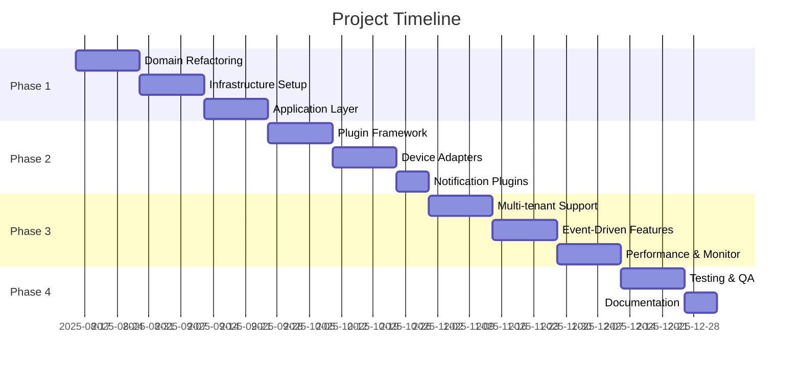

# Technical Specification: Staff Management System Architecture Refactoring

## 📋 Project Overview
**Project Name**: Staff Management System Architecture Refactoring  
**Version**: 2.0  
**Date**: August 13, 2025  
**Duration**: 3-6 months  
**Team Size**: 2-4 developers  

## 🎯 Objectives

### Primary Goals
1. **Scalability Enhancement** - Support for 100k+ employees and 1000+ devices
2. **Maintainability Improvement** - Reduce code complexity and increase testability
3. **Plugin Architecture** - Easy integration of new device types and features
4. **Performance Optimization** - Sub-200ms API response times
5. **Multi-tenant Support** - Single codebase for multiple organizations

### Secondary Goals
1. **Microservices Ready** - Prepare for future microservices migration
2. **Event-Driven Architecture** - Real-time data processing
3. **Advanced Security** - RBAC, audit trails, encryption
4. **Monitoring & Observability** - Full application monitoring

## 🏗️ Current State Analysis

### Strengths
- ✅ Clean Architecture foundations
- ✅ NestJS framework with TypeScript
- ✅ Prisma ORM with PostgreSQL
- ✅ Redis caching layer
- ✅ Basic authentication and authorization
- ✅ Swagger API documentation

### Pain Points
- ❌ Adapter duplication (`/modules/integrations/adapters` vs `/shared/adapters`)
- ❌ Mixed business logic and infrastructure concerns
- ❌ Difficult to add new device types
- ❌ Limited scalability for large deployments
- ❌ Complex testing setup
- ❌ Configuration scattered across modules

## 🎨 Target Architecture

### 1. Domain-Driven Design Structure
```
src/
├── 📁 domains/                    # Business domains
│   ├── 📁 staff-management/       
│   │   ├── entities/
│   │   ├── repositories/
│   │   ├── services/
│   │   ├── events/
│   │   └── value-objects/
│   ├── 📁 device-management/
│   ├── 📁 attendance-tracking/
│   └── 📁 access-control/
├── 📁 application/                # Use cases & handlers
│   ├── 📁 commands/
│   ├── 📁 queries/
│   ├── 📁 handlers/
│   └── 📁 dto/
├── 📁 infrastructure/             # External concerns
│   ├── 📁 database/
│   ├── 📁 adapters/
│   ├── 📁 messaging/
│   └── 📁 external-apis/
├── 📁 presentation/               # API layer
│   ├── 📁 controllers/
│   ├── 📁 middlewares/
│   └── 📁 validators/
└── 📁 shared/                     # Cross-cutting concerns
    ├── 📁 kernel/
    ├── 📁 utils/
    └── 📁 interfaces/
```

### 2. Plugin Architecture
```
plugins/
├── 📁 device-adapters/
│   ├── 📁 hikvision-plugin/
│   ├── 📁 zkteco-plugin/
│   ├── 📁 anviz-plugin/
│   └── 📁 generic-plugin/
├── 📁 notification-plugins/
│   ├── 📁 email-plugin/
│   ├── 📁 sms-plugin/
│   └── 📁 telegram-plugin/
└── 📁 reporting-plugins/
    ├── 📁 pdf-export/
    └── 📁 excel-export/
```

### 3. Event-Driven Architecture
```
src/events/
├── 📁 domain-events/
│   ├── employee-created.event.ts
│   ├── attendance-logged.event.ts
│   └── device-status-changed.event.ts
├── 📁 integration-events/
├── 📁 handlers/
└── 📁 publishers/
```

## 🔧 Technical Requirements

### 1. Framework & Libraries
```json
{
  "core": {
    "nestjs": "^11.x",
    "typescript": "^5.x",
    "prisma": "^5.x",
    "postgresql": "^16.x",
    "redis": "^7.x"
  },
  "new_dependencies": {
    "@nestjs/event-emitter": "^2.x",
    "@nestjs/bull": "^10.x",
    "class-transformer": "^0.5.x",
    "class-validator": "^0.14.x",
    "joi": "^17.x",
    "winston": "^3.x",
    "prometheus": "^15.x"
  }
}
```

### 2. Database Schema Optimization
```sql
-- Multi-tenant support
CREATE SCHEMA tenant_1;
CREATE SCHEMA tenant_2;

-- Performance indexes
CREATE INDEX CONCURRENTLY idx_attendance_employee_date 
ON attendance(employee_id, created_at);

-- Audit tables
CREATE TABLE audit_log (
    id UUID PRIMARY KEY,
    tenant_id UUID NOT NULL,
    entity_type VARCHAR(50),
    entity_id UUID,
    action VARCHAR(20),
    changes JSONB,
    created_at TIMESTAMP DEFAULT NOW()
);
```

### 3. Configuration Management
```typescript
// config/feature.config.ts
export interface FeatureConfig {
  devices: {
    maxConcurrentConnections: number;
    heartbeatInterval: number;
    adapters: AdapterConfig[];
  };
  notifications: {
    providers: NotificationProvider[];
    rateLimits: RateLimitConfig;
  };
  security: {
    encryption: EncryptionConfig;
    authentication: AuthConfig;
  };
}
```

## 📦 Implementation Phases

### Phase 1: Foundation Refactoring (4-6 weeks)
#### Week 1-2: Domain Extraction
- [ ] Extract Employee domain
- [ ] Extract Device domain  
- [ ] Extract Attendance domain
- [ ] Create domain interfaces and contracts

#### Week 3-4: Infrastructure Separation
- [ ] Consolidate adapters in `/infrastructure/adapters/`
- [ ] Create repository interfaces
- [ ] Implement Prisma repositories
- [ ] Set up event emitter system

#### Week 5-6: Application Layer
- [ ] Implement CQRS pattern
- [ ] Create command/query handlers
- [ ] Set up validation pipeline
- [ ] Update controllers to use application layer

### Phase 2: Plugin System (4-5 weeks)
#### Week 1-2: Plugin Framework
- [ ] Design plugin interface
- [ ] Create plugin loader system
- [ ] Implement plugin registry
- [ ] Set up plugin configuration

#### Week 3-4: Device Adapters as Plugins
- [ ] Convert Hikvision adapter to plugin
- [ ] Convert ZKTeco adapter to plugin
- [ ] Create generic device adapter plugin
- [ ] Implement plugin hot-loading

#### Week 5: Notification Plugins
- [ ] Email notification plugin
- [ ] SMS notification plugin
- [ ] In-app notification plugin

### Phase 3: Advanced Features (4-6 weeks)
#### Week 1-2: Multi-tenant Support
- [ ] Tenant management system
- [ ] Database schema per tenant
- [ ] Tenant context middleware
- [ ] Tenant-specific configurations

#### Week 3-4: Event-Driven Enhancements
- [ ] Event sourcing for audit
- [ ] Saga pattern for complex workflows
- [ ] Event replay capabilities
- [ ] Dead letter queue handling

#### Week 5-6: Performance & Monitoring
- [ ] Prometheus metrics
- [ ] Request tracing
- [ ] Performance monitoring
- [ ] Health check endpoints

### Phase 4: Testing & Documentation (2-3 weeks)
#### Week 1-2: Comprehensive Testing
- [ ] Unit tests for all domains
- [ ] Integration tests for plugins
- [ ] E2E tests for critical workflows
- [ ] Performance testing

#### Week 3: Documentation
- [ ] Architecture documentation
- [ ] Plugin development guide
- [ ] API documentation update
- [ ] Deployment guide

## 🧪 Testing Strategy

### 1. Testing Pyramid
```
                   E2E Tests (10%)
                 ┌─────────────────┐
               Integration Tests (20%)
             ┌─────────────────────────┐
           Unit Tests (70%)
         ┌─────────────────────────────────┐
```

### 2. Test Structure
```
tests/
├── 📁 unit/                       # Domain logic tests
│   ├── domains/
│   ├── application/
│   └── infrastructure/
├── 📁 integration/                # API integration tests
│   ├── controllers/
│   ├── repositories/
│   └── plugins/
└── 📁 e2e/                       # End-to-end workflows
    ├── employee-management.e2e.ts
    ├── device-integration.e2e.ts
    └── attendance-tracking.e2e.ts
```

### 3. Testing Requirements
- **Code Coverage**: Minimum 80%
- **Performance Tests**: All critical paths < 200ms
- **Load Testing**: Support 1000 concurrent users
- **Security Tests**: OWASP compliance

## 📊 Quality Metrics

### 1. Code Quality
- **TypeScript Strict Mode**: Enabled
- **ESLint**: No warnings
- **Prettier**: Consistent formatting
- **SonarQube**: Grade A

### 2. Performance Metrics
- **API Response Time**: < 200ms (95th percentile)
- **Database Query Time**: < 50ms average
- **Memory Usage**: < 512MB per instance
- **CPU Usage**: < 70% under normal load

### 3. Reliability Metrics
- **Uptime**: 99.9%
- **Error Rate**: < 0.1%
- **Data Consistency**: 100%
- **Backup Recovery**: < 4 hours RTO

## 🚀 Deployment Strategy

### 1. Environment Setup
```yaml
# docker-compose.production.yml
version: '3.8'
services:
  app:
    image: staff-management:latest
    environment:
      - NODE_ENV=production
      - DATABASE_URL=${DATABASE_URL}
      - REDIS_URL=${REDIS_URL}
    healthcheck:
      test: ["CMD", "curl", "-f", "http://localhost:3000/health"]
      interval: 30s
      timeout: 10s
      retries: 3
```

### 2. CI/CD Pipeline
```yaml
# .github/workflows/deploy.yml
name: Deploy
on:
  push:
    branches: [main]
jobs:
  test:
    runs-on: ubuntu-latest
    steps:
      - uses: actions/checkout@v3
      - name: Run Tests
        run: npm run test:ci
  deploy:
    needs: test
    runs-on: ubuntu-latest
    steps:
      - name: Deploy to Production
        run: |
          docker build -t staff-management:latest .
          docker push staff-management:latest
```

### 3. Monitoring Setup
```typescript
// monitoring/metrics.ts
export const metrics = {
  httpRequests: new Counter('http_requests_total'),
  httpDuration: new Histogram('http_duration_seconds'),
  activeConnections: new Gauge('active_connections'),
  pluginStatus: new Gauge('plugin_status')
};
```

## 📋 Deliverables

### 1. Code Deliverables
- [ ] Refactored application with new architecture
- [ ] Plugin system with sample plugins
- [ ] Comprehensive test suite
- [ ] Updated API documentation
- [ ] Performance monitoring dashboard

### 2. Documentation Deliverables
- [ ] Architecture Decision Records (ADRs)
- [ ] Plugin Development Guide
- [ ] Migration Guide from v1 to v2
- [ ] Operations Runbook
- [ ] Security Guidelines

### 3. Infrastructure Deliverables
- [ ] Docker containers for all environments
- [ ] Kubernetes deployment manifests
- [ ] CI/CD pipeline configuration
- [ ] Monitoring and alerting setup
- [ ] Backup and disaster recovery procedures

## 💰 Resource Estimation

### 1. Development Team
- **Senior Backend Developer**: 1 person × 6 months
- **Backend Developer**: 2 people × 4 months
- **DevOps Engineer**: 1 person × 2 months
- **QA Engineer**: 1 person × 3 months

### 2. Infrastructure Costs
- **Development Environment**: $500/month
- **Staging Environment**: $800/month
- **Production Environment**: $2000/month
- **Monitoring Tools**: $300/month

### 3. Third-party Services
- **Error Tracking (Sentry)**: $100/month
- **Monitoring (DataDog)**: $200/month
- **CI/CD (GitHub Actions)**: $50/month

## 🎯 Success Criteria

### 1. Technical Success
- [ ] All existing functionality preserved
- [ ] API response times improved by 50%
- [ ] Code complexity reduced by 40%
- [ ] Test coverage increased to 80%+

### 2. Business Success
- [ ] Support for 10x more concurrent users
- [ ] Reduced deployment time by 70%
- [ ] Decreased bug reports by 60%
- [ ] Improved developer productivity by 50%

### 3. Operational Success
- [ ] Zero-downtime deployments
- [ ] Automated monitoring and alerting
- [ ] Self-healing system capabilities
- [ ] Comprehensive documentation

## 🔍 Risk Assessment

### 1. Technical Risks
| Risk | Impact | Probability | Mitigation |
|------|--------|-------------|------------|
| Performance regression | High | Medium | Comprehensive performance testing |
| Data migration issues | High | Low | Incremental migration with rollback |
| Plugin system complexity | Medium | Medium | Start with simple plugins, iterate |
| Third-party integration issues | Medium | Low | Maintain backward compatibility |

### 2. Business Risks
| Risk | Impact | Probability | Mitigation |
|------|--------|-------------|------------|
| Extended downtime | High | Low | Blue-green deployment strategy |
| Feature delays | Medium | Medium | Agile methodology with MVP approach |
| Resource unavailability | Medium | Medium | Cross-training and documentation |
| Scope creep | Medium | High | Regular stakeholder communication |

## 📅 Timeline Summary



---

**Approval Required**: Technical Lead, Project Manager, Stakeholders  
**Review Date**: Every 2 weeks  
**Next Review**: August 27, 2025
