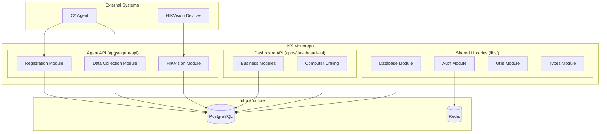
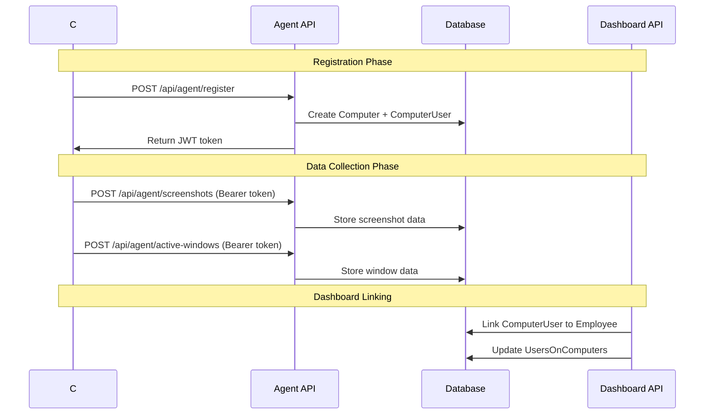

# Final Implementation Plan - NX Monorepo Architecture

## 🏗️ **SYSTEM ARCHITECTURE OVERVIEW**

### **NX Monorepo Structure**
```
staff/
├── apps/
│   ├── dashboard-api/     # NestJS - Dashboard Backend API
│   └── agent-api/         # NestJS - Agent Data Collection API
├── libs/
│   ├── shared/
│   │   ├── database/      # Prisma client, models
│   │   ├── auth/          # Authentication utilities
│   │   ├── utils/         # Common utilities
│   │   └── types/         # TypeScript interfaces
└── shared/
    └── database/
        └── prisma/        # Database schema
```

### **Data Flow Architecture**


## 📋 **CURRENT STATUS ANALYSIS**

### ✅ **Dashboard API Modules (12/15 Complete)**
1. **Auth Module** ✅ - JWT authentication
2. **User Module** ✅ - User management, roles
3. **Organization Module** ✅ - Organization CRUD
4. **Department Module** ✅ - Hierarchical departments
5. **Employee Module** ✅ - Employee CRUD, linking
6. **Policy Module** ✅ - Monitoring policies
7. **Computer Users Module** ✅ - Computer user management
8. **Devices Module** ✅ - HIKVision device management
9. **Visitors Module** ✅ - Visitor management
10. **Onetime Codes Module** ✅ - Visitor access codes
11. **Reports Module** ✅ - Basic reporting
12. **Entry Logs Module** ✅ - Entry/exit tracking

### 🔄 **Dashboard API Missing (3/15)**
1. **Credentials Module** - Employee cards/codes
2. **Gates Module** - Gate management
3. **ChangeHistory Module** - Audit logging

### ❌ **Agent API Modules (0/6 Complete)**
1. **Registration Module** - Agent registration & token
2. **Data Collection Module** - Screenshots, windows, sites
3. **HIKVision Module** - Device integration
4. **Computer Module** - Computer registration
5. **UsersOnComputers Module** - Junction management
6. **Monitoring Module** - Real-time data processing

### 🔄 **Shared Libraries (Partial)**
1. **Database Module** ✅ - Prisma setup
2. **Auth Module** ✅ - Basic auth
3. **Utils Module** ❌ - Need to extract common utilities
4. **Types Module** ❌ - Need shared interfaces

## 🎯 **IMPLEMENTATION PHASES**

### **PHASE 1: SHARED LIBRARIES SETUP (3-4 days)**

#### 1.1 Extract Shared Utilities (2 days)
```typescript
// libs/shared/utils/src/
├── password/
│   ├── password.util.ts
│   └── index.ts
├── validation/
│   ├── validation.util.ts
│   └── index.ts
├── date/
│   ├── date.util.ts
│   └── index.ts
└── index.ts
```

#### 1.2 Create Shared Types (1 day)
```typescript
// libs/shared/types/src/
├── user-context.interface.ts
├── data-scope.interface.ts
├── pagination.interface.ts
├── query.interface.ts
└── index.ts
```

#### 1.3 Enhanced Auth Module (1 day)
```typescript
// libs/shared/auth/src/
├── guards/
├── decorators/
├── strategies/
├── interfaces/
└── index.ts
```

### **PHASE 2: AGENT API DEVELOPMENT (8-10 days)**

#### 2.1 Agent Registration Module (2 days)
```typescript
// apps/agent-api/src/modules/registration/
├── dto/
│   ├── register-agent.dto.ts
│   └── agent-info.dto.ts
├── services/
│   └── registration.service.ts
├── controllers/
│   └── registration.controller.ts
└── registration.module.ts
```

**Key Features:**
- Agent registration with PC info
- Token generation for agents
- Computer + ComputerUser creation
- Agent authentication

**API Endpoints:**
```typescript
POST /api/agent/register
{
  "pcInfo": {
    "computerUid": "unique-pc-id",
    "os": "Windows 11",
    "ipAddress": "192.168.1.100",
    "macAddress": "00:1B:44:11:3A:B7"
  },
  "userInfo": {
    "sid": "S-1-5-21-...",
    "username": "john.doe",
    "name": "John Doe",
    "domain": "COMPANY",
    "isAdmin": false,
    "isInDomain": true
  }
}

Response: {
  "token": "agent-jwt-token",
  "computerId": 123,
  "computerUserId": 456
}
```

#### 2.2 Data Collection Module (3 days)
```typescript
// apps/agent-api/src/modules/data-collection/
├── dto/
│   ├── screenshot.dto.ts
│   ├── active-window.dto.ts
│   ├── visited-site.dto.ts
│   └── user-session.dto.ts
├── services/
│   ├── screenshot.service.ts
│   ├── active-window.service.ts
│   ├── visited-site.service.ts
│   └── user-session.service.ts
├── controllers/
│   └── data-collection.controller.ts
└── data-collection.module.ts
```

**API Endpoints:**
```typescript
POST /api/agent/screenshots
POST /api/agent/active-windows
POST /api/agent/visited-sites
POST /api/agent/user-sessions
```

#### 2.3 HIKVision Integration Module (2 days)
```typescript
// apps/agent-api/src/modules/hikvision/
├── dto/
│   ├── device-action.dto.ts
│   └── device-status.dto.ts
├── services/
│   └── hikvision.service.ts
├── controllers/
│   └── hikvision.controller.ts
└── hikvision.module.ts
```

**API Endpoints:**
```typescript
POST /api/agent/hikvision/actions
POST /api/agent/hikvision/device-status
POST /api/agent/hikvision/events
```

#### 2.4 Computer Management Module (2 days)
```typescript
// apps/agent-api/src/modules/computer/
├── services/
│   ├── computer.service.ts
│   └── users-on-computers.service.ts
└── computer.module.ts
```

#### 2.5 Real-time Processing Module (1 day)
```typescript
// apps/agent-api/src/modules/processing/
├── services/
│   ├── queue.service.ts
│   └── notification.service.ts
└── processing.module.ts
```

### **PHASE 3: DASHBOARD API COMPLETION (4-5 days)**

#### 3.1 Credentials Module (2 days)
```typescript
// apps/dashboard-api/src/modules/credentials/
├── dto/credential.dto.ts
├── repositories/credential.repository.ts
├── services/credential.service.ts
├── controllers/credential.controller.ts
└── credential.module.ts
```

#### 3.2 Gates Module (1 day)
```typescript
// apps/dashboard-api/src/modules/gates/
├── dto/gate.dto.ts
├── repositories/gate.repository.ts
├── services/gate.service.ts
├── controllers/gate.controller.ts
└── gate.module.ts
```

#### 3.3 ChangeHistory Module (2 days)
```typescript
// apps/dashboard-api/src/modules/change-history/
├── dto/change-history.dto.ts
├── repositories/change-history.repository.ts
├── services/change-history.service.ts
├── controllers/change-history.controller.ts
└── change-history.module.ts
```

### **PHASE 4: INTEGRATION & OPTIMIZATION (3-4 days)**

#### 4.1 Computer Linking Enhancement (1 day)
- Dashboard orqali Computer va Employee linking
- Unlinked computers ro'yxati
- Bulk linking operations

#### 4.2 Real-time Features (2 days)
- WebSocket integration
- Real-time notifications
- Live monitoring dashboard

#### 4.3 Performance Optimization (1 day)
- Caching strategies
- Database indexing
- Query optimization

## 📊 **DETAILED TIMELINE**

| Phase | Tasks | Duration | Dependencies |
|-------|-------|----------|--------------|
| **Phase 1** | Shared Libraries | 3-4 days | None |
| **Phase 2** | Agent API | 8-10 days | Phase 1 |
| **Phase 3** | Dashboard API Completion | 4-5 days | Phase 1 |
| **Phase 4** | Integration & Optimization | 3-4 days | Phase 2, 3 |

**Total Duration: 18-23 days (4-5 weeks)**

## 🔧 **TECHNICAL SPECIFICATIONS**

### **Agent Authentication Flow**


### **Shared Package Structure**
```typescript
// libs/shared/utils/src/password/password.util.ts
export class PasswordUtil {
  static async hash(password: string): Promise<string>
  static async compare(password: string, hash: string): Promise<boolean>
  static validatePassword(password: string): ValidationResult
}

// libs/shared/types/src/user-context.interface.ts
export interface UserContext {
  sub: string;
  username: string;
  role: Role;
  organizationId?: number;
  departmentIds?: number[];
}
```

### **Agent API Authentication**
```typescript
// Agent-specific JWT strategy
@Injectable()
export class AgentJwtStrategy extends PassportStrategy(Strategy, 'agent-jwt') {
  constructor() {
    super({
      jwtFromRequest: ExtractJwt.fromAuthHeaderAsBearerToken(),
      secretOrKey: process.env.AGENT_JWT_SECRET,
    });
  }

  async validate(payload: any) {
    return {
      computerId: payload.computerId,
      computerUserId: payload.computerUserId,
      computerUid: payload.computerUid
    };
  }
}
```

## 🎯 **SUCCESS CRITERIA**

### **Technical Metrics**
- [ ] Agent API handles 1000+ concurrent agents
- [ ] Data collection latency <100ms
- [ ] Dashboard API response time <200ms
- [ ] 95%+ uptime for both APIs
- [ ] Zero data loss during collection

### **Business Metrics**
- [ ] Real-time computer monitoring
- [ ] Accurate entry/exit tracking
- [ ] Employee-computer linking works
- [ ] HIKVision integration functional
- [ ] Comprehensive audit logging

## 🚀 **NEXT STEPS**

1. **Start with Phase 1** - Shared libraries extraction
2. **Set up Agent API project** structure
3. **Implement registration flow** first
4. **Test with sample C# agent**
5. **Continue with data collection**

Bu plan sizga mos keladimi? Qaysi qismdan boshlashni xohlaysiz?