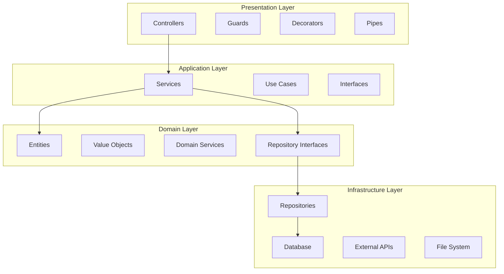
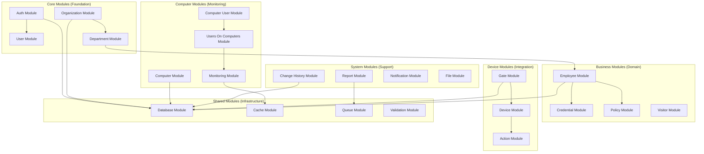

# Hodimlarni Nazorat Qilish Tizimi - Best Practice System Design

## 1. SYSTEM DESIGN PRINCIPLES

### 1.1 SOLID Principles
- **Single Responsibility**: Har bir class/module bitta vazifani bajaradi
- **Open/Closed**: Extension uchun ochiq, modification uchun yopiq
- **Liskov Substitution**: Base classlarni derived classlar bilan almashtirish mumkin
- **Interface Segregation**: Kichik, specific interfacelar
- **Dependency Inversion**: Abstractions ga bog'lanish, concrete classlar ga emas

### 1.2 Clean Architecture Layers


### 1.3 Design Patterns
- **Repository Pattern**: Data access abstraction
- **Factory Pattern**: Object creation
- **Strategy Pattern**: Algorithm selection
- **Observer Pattern**: Event handling
- **Decorator Pattern**: Feature extension
- **Singleton Pattern**: Single instance services

## 2. MODULAR ARCHITECTURE DESIGN

### 2.1 Module Hierarchy


### 2.2 Implementation Priority (Dependency Order)

```mermaid
graph LR
    subgraph "Phase 1: Foundation"
        P1_1[1. Shared Modules]
        P1_2[2. Auth Module]
        P1_3[3. User Module]
        P1_4[4. Organization Module]
    end
    
    subgraph "Phase 2: Core Business"
        P2_1[5. Department Module]
        P2_2[6. Employee Module]
        P2_3[7. Credential Module]
        P2_4[8. Policy Module ✅]
    end
    
    subgraph "Phase 3: Device Integration"
        P3_1[9. Gate Module]
        P3_2[10. Device Module ✅]
        P3_3[11. Action Module]
    end
    
    subgraph "Phase 4: Computer Monitoring"
        P4_1[12. Computer Module]
        P4_2[13. Computer User Module ✅]
        P4_3[14. Users On Computers Module]
        P4_4[15. Monitoring Module]
    end
    
    subgraph "Phase 5: Visitor Management"
        P5_1[16. Visitor Module ✅]
        P5_2[17. Onetime Code Module ✅]
    end
    
    subgraph "Phase 6: System Features"
        P6_1[18. Change History Module]
        P6_2[19. Report Module]
        P6_3[20. Notification Module]
    end
    
    P1_1 --> P1_2
    P1_2 --> P1_3
    P1_3 --> P1_4
    P1_4 --> P2_1
    P2_1 --> P2_2
    P2_2 --> P2_3
    P2_3 --> P2_4
    P2_4 --> P3_1
    P3_1 --> P3_2
    P3_2 --> P3_3
    P3_3 --> P4_1
    P4_1 --> P4_2
    P4_2 --> P4_3
    P4_3 --> P4_4
    P4_4 --> P5_1
    P5_1 --> P5_2
    P5_2 --> P6_1
    P6_1 --> P6_2
    P6_2 --> P6_3
```


## 3. BEST PRACTICES PER LAYER

### 3.1 Controller Layer Best Practices
```typescript
// ✅ Good Practice
@Controller('employees')
@ApiTags('Employees')
@ApiBearerAuth()
@Roles(Role.ADMIN, Role.HR)
export class EmployeeController {
    constructor(private readonly employeeService: EmployeeService) {}

    @Get()
    @ApiCrudOperation(EmployeeDto, 'list', {
        summary: 'Get employees with pagination',
        includeQueries: { pagination: true, search: true, sort: true }
    })
    async findAll(
        @Query() query: QueryDto,
        @CurrentUser() user: UserContext,
        @Scope() scope: DataScope
    ): Promise<PaginationResponseDto<EmployeeDto>> {
        return this.employeeService.findAll(query, scope, user);
    }
}

// ❌ Bad Practice
@Controller('employees')
export class EmployeeController {
    @Get()
    async getEmployees(@Query() query: any): Promise<any> {
        // Direct database access in controller
        return this.prisma.employee.findMany();
    }
}
```

### 3.2 Service Layer Best Practices
```typescript
// ✅ Good Practice
@Injectable()
export class EmployeeService {
    constructor(
        private readonly employeeRepository: EmployeeRepository,
        private readonly changeHistoryService: ChangeHistoryService,
        private readonly cacheService: CacheService
    ) {}

    async findAll(query: QueryDto, scope: DataScope, user: UserContext): Promise<PaginationResponseDto<Employee>> {
        // Business logic validation
        this.validateUserAccess(user, scope);
        
        // Use repository pattern
        const result = await this.employeeRepository.findManyWithPagination(
            this.buildWhereClause(query, scope),
            this.buildOrderBy(query),
            this.buildInclude(),
            { page: query.page, limit: query.limit },
            scope
        );

        // Cache result if needed
        await this.cacheService.set(`employees:${user.id}:${JSON.stringify(query)}`, result, 300);
        
        return result;
    }

    private validateUserAccess(user: UserContext, scope: DataScope): void {
        if (user.role === Role.DEPARTMENT_LEAD && !scope.departments?.length) {
            throw new ForbiddenException('Department Lead must have department scope');
        }
    }
}

// ❌ Bad Practice
@Injectable()
export class EmployeeService {
    async getEmployees(query: any): Promise<any> {
        // Direct database access, no validation, no error handling
        return this.prisma.employee.findMany({ where: query });
    }
}
```

### 3.3 Repository Layer Best Practices
```typescript
// ✅ Good Practice
@Injectable()
export class EmployeeRepository extends BaseRepository<
    Employee,
    Prisma.EmployeeCreateInput,
    Prisma.EmployeeUpdateInput,
    Prisma.EmployeeWhereInput,
    Prisma.EmployeeWhereUniqueInput,
    Prisma.EmployeeOrderByWithRelationInput,
    Prisma.EmployeeInclude,
    Prisma.EmployeeSelect
> {
    constructor(protected readonly prisma: PrismaService) {
        super(prisma);
    }

    protected readonly modelName = Prisma.ModelName.Employee;
    protected getDelegate() {
        return this.prisma.employee;
    }

    // Specific business queries
    async findByDepartment(departmentId: number, include?: Prisma.EmployeeInclude): Promise<Employee[]> {
        return this.findMany({ departmentId }, { name: 'asc' }, include);
    }

    async findActiveEmployeesWithCredentials(): Promise<Employee[]> {
        return this.findMany(
            { isActive: true },
            { name: 'asc' },
            { credentials: { where: { isActive: true } } }
        );
    }
}

// ❌ Bad Practice
@Injectable()
export class EmployeeRepository {
    constructor(private prisma: PrismaService) {}

    async getAll(): Promise<any> {
        return this.prisma.employee.findMany();
    }
}
```

### 3.4 DTO Best Practices
```typescript
// ✅ Good Practice
export class CreateEmployeeDto {
    @ApiProperty({ example: 'John Doe', description: 'Employee full name' })
    @IsString()
    @IsNotEmpty()
    @Length(2, 100)
    name: string;

    @ApiProperty({ example: 1, description: 'Department ID' })
    @IsInt()
    @IsPositive()
    departmentId: number;

    @ApiProperty({ example: 'john@company.com', description: 'Employee email', required: false })
    @IsOptional()
    @IsEmail()
    email?: string;

    @ApiProperty({ example: '+998901234567', description: 'Phone number', required: false })
    @IsOptional()
    @IsPhoneNumber('UZ')
    phone?: string;
}

// ❌ Bad Practice
export class CreateEmployeeDto {
    name: any;
    departmentId: any;
    email: any;
    phone: any;
}
```

## 4. ERROR HANDLING STRATEGY

### 4.1 Exception Hierarchy
```typescript
// Base Exception
export abstract class BaseException extends Error {
    abstract readonly statusCode: number;
    abstract readonly errorCode: string;
    
    constructor(message: string, public readonly context?: Record<string, any>) {
        super(message);
    }
}

// Business Logic Exceptions
export class BusinessLogicException extends BaseException {
    readonly statusCode = 400;
    readonly errorCode = 'BUSINESS_LOGIC_ERROR';
}

export class ResourceNotFoundException extends BaseException {
    readonly statusCode = 404;
    readonly errorCode = 'RESOURCE_NOT_FOUND';
}

export class AccessDeniedException extends BaseException {
    readonly statusCode = 403;
    readonly errorCode = 'ACCESS_DENIED';
}

// Usage in Service
async findEmployee(id: number, user: UserContext): Promise<Employee> {
    const employee = await this.employeeRepository.findById(id);
    
    if (!employee) {
        throw new ResourceNotFoundException(`Employee with ID ${id} not found`);
    }
    
    if (!this.canUserAccessEmployee(user, employee)) {
        throw new AccessDeniedException('User cannot access this employee');
    }
    
    return employee;
}
```

### 4.2 Global Exception Filter
```typescript
@Catch()
export class GlobalExceptionFilter implements ExceptionFilter {
    private readonly logger = new Logger(GlobalExceptionFilter.name);

    catch(exception: unknown, host: ArgumentsHost) {
        const ctx = host.switchToHttp();
        const response = ctx.getResponse<Response>();
        const request = ctx.getRequest<Request>();

        let status = 500;
        let errorCode = 'INTERNAL_SERVER_ERROR';
        let message = 'Internal server error';

        if (exception instanceof BaseException) {
            status = exception.statusCode;
            errorCode = exception.errorCode;
            message = exception.message;
        } else if (exception instanceof HttpException) {
            status = exception.getStatus();
            message = exception.message;
        }

        const errorResponse = {
            success: false,
            error: {
                code: errorCode,
                message,
                timestamp: new Date().toISOString(),
                path: request.url,
            },
        };

        this.logger.error(`${errorCode}: ${message}`, exception instanceof Error ? exception.stack : exception);

        response.status(status).json(errorResponse);
    }
}
```

## 5. CACHING STRATEGY

### 5.1 Multi-Level Caching
```typescript
@Injectable()
export class CacheService {
    constructor(
        private readonly redisService: RedisService,
        private readonly memoryCache: MemoryCacheService
    ) {}

    async get<T>(key: string): Promise<T | null> {
        // Level 1: Memory Cache (fastest)
        let result = await this.memoryCache.get<T>(key);
        if (result) return result;

        // Level 2: Redis Cache
        result = await this.redisService.get<T>(key);
        if (result) {
            // Populate memory cache
            await this.memoryCache.set(key, result, 60); // 1 minute
            return result;
        }

        return null;
    }

    async set<T>(key: string, value: T, ttl: number): Promise<void> {
        // Set in both caches
        await Promise.all([
            this.memoryCache.set(key, value, Math.min(ttl, 300)), // Max 5 minutes in memory
            this.redisService.set(key, value, ttl)
        ]);
    }
}

// Usage in Service
async findEmployee(id: number): Promise<Employee> {
    const cacheKey = `employee:${id}`;
    
    // Try cache first
    let employee = await this.cacheService.get<Employee>(cacheKey);
    if (employee) return employee;

    // Fetch from database
    employee = await this.employeeRepository.findById(id);
    if (employee) {
        await this.cacheService.set(cacheKey, employee, 600); // 10 minutes
    }

    return employee;
}
```

## 6. SECURITY BEST PRACTICES

### 6.1 Input Validation & Sanitization
```typescript
// Custom Validation Pipe
@Injectable()
export class CustomValidationPipe extends ValidationPipe {
    constructor() {
        super({
            whitelist: true, // Strip unknown properties
            forbidNonWhitelisted: true, // Throw error for unknown properties
            transform: true, // Transform to DTO instance
            transformOptions: {
                enableImplicitConversion: true,
            },
            exceptionFactory: (errors: ValidationError[]) => {
                const messages = errors.map(error => ({
                    field: error.property,
                    errors: Object.values(error.constraints || {}),
                }));
                return new BadRequestException({
                    message: 'Validation failed',
                    errors: messages,
                });
            },
        });
    }
}

// SQL Injection Prevention
@Injectable()
export class EmployeeService {
    async searchEmployees(searchTerm: string): Promise<Employee[]> {
        // ✅ Good: Using Prisma's built-in protection
        return this.employeeRepository.findMany({
            OR: [
                { name: { contains: searchTerm, mode: 'insensitive' } },
                { email: { contains: searchTerm, mode: 'insensitive' } }
            ]
        });

        // ❌ Bad: Raw SQL without parameterization
        // return this.prisma.$queryRaw`SELECT * FROM employees WHERE name LIKE '%${searchTerm}%'`;
    }
}
```

### 6.2 RBAC Implementation
```typescript
// Role-based Access Control
@Injectable()
export class RBACService {
    private readonly permissions = new Map<Role, Set<string>>([
        [Role.ADMIN, new Set(['*'])], // All permissions
        [Role.HR, new Set(['employee:read', 'employee:write', 'department:read'])],
        [Role.DEPARTMENT_LEAD, new Set(['employee:read', 'report:read'])],
        [Role.GUARD, new Set(['visitor:read', 'action:read'])],
    ]);

    hasPermission(userRole: Role, permission: string): boolean {
        const userPermissions = this.permissions.get(userRole);
        return userPermissions?.has('*') || userPermissions?.has(permission) || false;
    }

    checkPermission(userRole: Role, permission: string): void {
        if (!this.hasPermission(userRole, permission)) {
            throw new AccessDeniedException(`Insufficient permissions for ${permission}`);
        }
    }
}

// Usage in Service
async updateEmployee(id: number, updateData: UpdateEmployeeDto, user: UserContext): Promise<Employee> {
    this.rbacService.checkPermission(user.role, 'employee:write');
    
    const employee = await this.findEmployee(id, user);
    return this.employeeRepository.update(id, updateData);
}
```

## 7. TESTING STRATEGY

### 7.1 Testing Pyramid
```typescript
// Unit Tests (70%)
describe('EmployeeService', () => {
    let service: EmployeeService;
    let repository: jest.Mocked<EmployeeRepository>;

    beforeEach(async () => {
        const module = await Test.createTestingModule({
            providers: [
                EmployeeService,
                { provide: EmployeeRepository, useValue: createMockRepository() },
            ],
        }).compile();

        service = module.get<EmployeeService>(EmployeeService);
        repository = module.get(EmployeeRepository);
    });

    it('should find employee by id', async () => {
        const employee = { id: 1, name: 'John Doe' } as Employee;
        repository.findById.mockResolvedValue(employee);

        const result = await service.findOne(1, mockUserContext);

        expect(result).toEqual(employee);
        expect(repository.findById).toHaveBeenCalledWith(1);
    });
});

// Integration Tests (20%)
describe('EmployeeController (Integration)', () => {
    let app: INestApplication;

    beforeEach(async () => {
        const moduleFixture = await Test.createTestingModule({
            imports: [AppModule],
        }).compile();

        app = moduleFixture.createNestApplication();
        await app.init();
    });

    it('/employees (GET)', () => {
        return request(app.getHttpServer())
            .get('/employees')
            .set('Authorization', 'Bearer valid-token')
            .expect(200)
            .expect((res) => {
                expect(res.body.data).toBeDefined();
                expect(Array.isArray(res.body.data)).toBe(true);
            });
    });
});

// E2E Tests (10%)
describe('Employee Management (E2E)', () => {
    it('should create, read, update, and delete employee', async () => {
        // Create
        const createResponse = await request(app.getHttpServer())
            .post('/employees')
            .send(createEmployeeDto)
            .expect(201);

        const employeeId = createResponse.body.data.id;

        // Read
        await request(app.getHttpServer())
            .get(`/employees/${employeeId}`)
            .expect(200);

        // Update
        await request(app.getHttpServer())
            .put(`/employees/${employeeId}`)
            .send(updateEmployeeDto)
            .expect(200);

        // Delete
        await request(app.getHttpServer())
            .delete(`/employees/${employeeId}`)
            .expect(200);
    });
});
```

## 8. PERFORMANCE OPTIMIZATION

### 8.1 Database Optimization
```typescript
// Efficient Queries
@Injectable()
export class EmployeeService {
    async findEmployeesWithDetails(query: QueryDto): Promise<Employee[]> {
        // ✅ Good: Single query with joins
        return this.employeeRepository.findMany(
            this.buildWhereClause(query),
            { name: 'asc' },
            {
                department: {
                    select: { id: true, fullName: true }
                },
                credentials: {
                    where: { isActive: true },
                    select: { id: true, code: true, type: true }
                },
                _count: {
                    select: { actions: true }
                }
            }
        );

        // ❌ Bad: N+1 queries
        // const employees = await this.employeeRepository.findMany();
        // for (const employee of employees) {
        //     employee.department = await this.departmentRepository.findById(employee.departmentId);
        //     employee.credentials = await this.credentialRepository.findByEmployeeId(employee.id);
        // }
    }
}

// Database Indexes (in Prisma schema)
model Employee {
    id           Int    @id @default(autoincrement())
    departmentId Int    @map("department_id")
    name         String
    email        String?
    
    @@index([departmentId]) // For department-based queries
    @@index([email]) // For email lookups
    @@index([name]) // For name searches
    @@index([departmentId, isActive]) // Composite index for common queries
}
```

### 8.2 Pagination & Filtering
```typescript
@Injectable()
export class EmployeeService {
    async findAll(query: QueryDto, scope: DataScope): Promise<PaginationResponseDto<Employee>> {
        const { page = 1, limit = 10, search, sort = 'name', order = 'asc' } = query;
        
        // Build efficient where clause
        const where: Prisma.EmployeeWhereInput = {
            ...this.applyDataScope(scope),
            ...(search && {
                OR: [
                    { name: { contains: search, mode: 'insensitive' } },
                    { email: { contains: search, mode: 'insensitive' } }
                ]
            })
        };

        // Use cursor-based pagination for large datasets
        if (limit > 100) {
            return this.findWithCursorPagination(where, sort, order, limit);
        }

        // Regular offset pagination for smaller datasets
        return this.employeeRepository.findManyWithPagination(
            where,
            { [sort]: order },
            this.getOptimizedInclude(),
            { page, limit },
            scope
        );
    }

    private getOptimizedInclude(): Prisma.EmployeeInclude {
        return {
            department: {
                select: { id: true, fullName: true } // Only needed fields
            },
            _count: {
                select: { credentials: true, actions: true }
            }
            // Don't include large relations by default
        };
    }
}
```

Bu best practice system design barcha zamonaviy development standartlarini qamrab oladi va scalable, maintainable, secure tizim yaratish uchun yo'l ko'rsatma beradi.